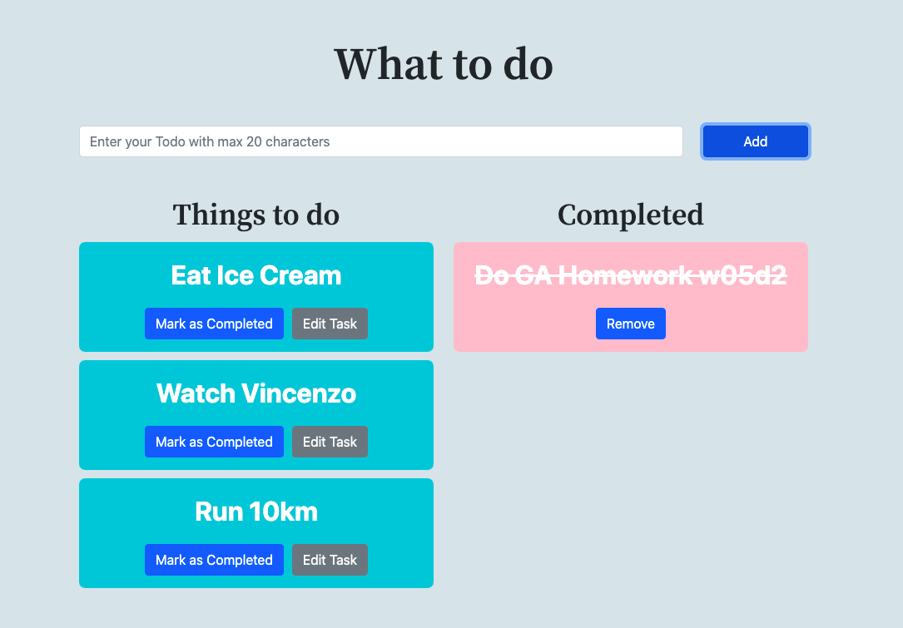
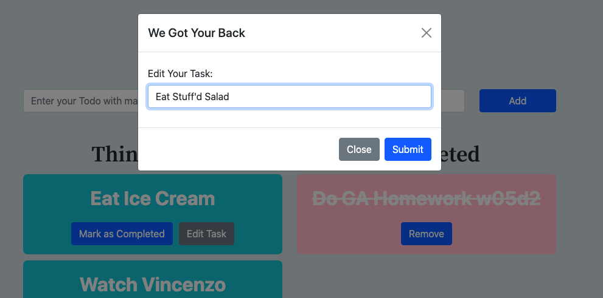

# Homework W05d2: Todo List

Simple todolist, build with Bootstrap with native content (no onload button/submission)

Some features in this todolist are:

1. Task Input is limited to 20 characters
1. Additional button to edit existing todolist task
1. Move task from "things to do" to "completed"
1. 'Remove Button' to delete the completed task
1. Refactor with functions
1. Calm and soothing CSS color

## You can find the screenshot below

